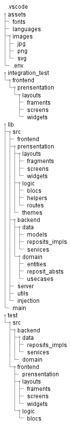

# Flutter Mobile

### Auteur : James Brel (The Coder)

### Contact : thecoder38@gmail.com, jamesbrel119@gmail.com 

### Architecture 
   the architecture is based on the own architecture which is constituted mainly of 3 layers :
   - Data
   - Domain
   - Presentation
 
 however, the architecture here has a certain logic that will give a good starting point for a very profitable development 

### Image
 

### Usage et Ordre de Configuration

Once you have created your application or flutter project, you clone the architecture from Github, to start on a good basis

Note: 
the predefined files, such as welcome.dart in the front end and other folders, as well as example_test file, are only files that will allow you to be on the right track and to get a good understanding of the architecture.

 - step_1: Installation of pre_packages
    Inside the pubspec.yaml file, you must integrate firstly the following packages : 

     - flutter_localizations:
           sdk: flutter
     - flutter_screenutil
     - go_router
     - intl : (we recommanded to use v0.17) 
    
    these packages will allow you to easily activate the various files imported into the architecture.
    then, you just have to follow, the readme.md in the folder **assets**

- step_2: Integration of the architecture
   once in the clean architecture folder, you copy all its content to paste it in your project.

 Copyright &copy; 2023 Utech All Rights Reserved

